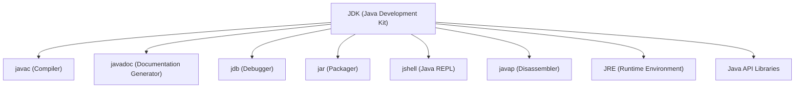

# Java Runtime & Development Ecosystem Diagram

 ```mermaid
graph TD
  JDK["JDK (Java Development Kit)"]
  javac["javac (Compiler)"]
  javadoc["javadoc (Documentation)"]
  jdb["jdb (Debugger)"]
  jar["jar (Packager)"]
  jshell["jshell (Java REPL)"]
  javap["javap (Disassembler)"]
  JRE["JRE (Java Runtime Environment)"]
  JVM["JVM (Java Virtual Machine)"]
  API["Java API (Standard Libraries)"]

  classLoader["Class Loader"]
  bytecodeVerifier["Bytecode Verifier"]
  interpreter["Interpreter"]
  jit["JIT Compiler"]
  gc["Garbage Collector"]

  lang["java.lang"]
  util["java.util"]
  io["java.io"]
  nio["java.nio"]
  net["java.net"]
  sql["java.sql"]
  time["java.time"]
  swing["javax.swing"]
  security["java.security"]

  JDK --> javac
  JDK --> javadoc
  JDK --> jdb
  JDK --> jar
  JDK --> JRE
  JDK --> jshell
  JDK --> javap

  JRE --> JVM
  JRE --> API

  JVM --> classLoader
  JVM --> bytecodeVerifier
  JVM --> interpreter
  JVM --> jit
  JVM --> gc

  API --> lang
  API --> util
  API --> io
  API --> nio
  API --> net
  API --> sql
  API --> time
  API --> swing
  API --> security
```


# Java Development Kit (JDK)

The **Java Development Kit (JDK)** is the official development toolkit used to **create Java applications**. It includes tools for writing, compiling, debugging, documenting, and packaging Java programs.

> JDK = JRE (to run Java apps) + Developer Tools (to build Java apps)

---

## Core Components of JDK

| Tool      | Purpose                                                            | Usage Example                     |
| --------- | ------------------------------------------------------------------ | --------------------------------- |
| `javac`   | Java compiler – Compiles `.java` source into `.class` bytecode     | `javac HelloWorld.java`           |
| `javadoc` | Documentation generator – Converts Javadoc comments into HTML docs | `javadoc -d docs HelloWorld.java` |
| `jdb`     | Debugger – Step through code, set breakpoints, inspect variables   | `jdb HelloWorld`                  |
| `jar`     | Packager – Bundles `.class` files into `.jar` archives             | `jar cf app.jar *.class`          |
| `jshell`  | Java REPL – Interactive shell for experimenting with Java code     | `jshell`                          |
| `javap`   | Disassembler – View bytecode structure of compiled `.class` files  | `javap HelloWorld`                |
| `jre`     | Runtime – To execute Java apps (includes JVM + libraries)          | N/A (runs implicitly)             |
| `API`     | Pre-built libraries – Used in writing programs                     | `java.util.*`, `java.io.*`, etc.  |

---

### Tool Details

---

### 1. `javac` – Java Compiler

* Converts human-readable `.java` files into JVM-readable `.class` files (bytecode).
* Validates syntax and type safety.

---

### 2. `javadoc` – Documentation Generator

* Parses specially formatted comments and creates developer-friendly documentation in HTML.
* Helps in large codebases and API development.

---

### 3. `jdb` – Java Debugger

* Allows interactive debugging of Java programs from the terminal.
* Supports:

  * Breakpoints
  * Stack trace inspection
  * Step-by-step execution

---

### 4. `jar` – Java Archiver

* Packages compiled bytecode into a distributable `.jar` file.
* Often used to deliver:

  * Applications
  * Frameworks
  * Java libraries

---

### 5. `jshell` – Java Shell (Introduced in Java 9)

* Interactive REPL (Read-Eval-Print Loop) for experimenting with Java code line-by-line.
* Ideal for learning, testing small snippets, or prototyping logic.

```bash
jshell
jshell> int x = 5;
jshell> System.out.println(x * 2);
```

---

### 6. `javap` – Java Disassembler

* Used to inspect the compiled `.class` file.
* Helps understand:

  * Compiler output
  * Bytecode structure
  * Signatures of methods, fields, etc.

```bash
javap HelloWorld
```

---

## Real-World Uses of JDK

| Use Case                   | Description                                                                                                               |
| -------------------------- | ------------------------------------------------------------------------------------------------------------------------- |
| **Enterprise Development** | Building large-scale systems in banking, insurance, and logistics. JDK is used with frameworks like Spring and Hibernate. |
| **Android Development**    | Android apps are written in Java/Kotlin. JDK is used to compile Java source before converting to Dalvik/ART bytecode.     |
| **Web Applications**       | Backend APIs built using Java + Spring Boot use JDK for development, build tools, and packaging.                          |
| **Desktop Applications**   | Applications like IDEs (NetBeans, IntelliJ) and GUI-based tools use Swing/JavaFX – built with JDK.                        |
| **Learning & Prototyping** | `jshell` is used in education, interviews, and quick experiments.                                                         |
| **Open Source Libraries**  | Many open-source Java libraries and tools are built using JDK and distributed as `.jar` files.                            |


## Diagram: JDK and Its Tools




Here’s a **detailed explanation of JRE, JVM, and JIT**, written clearly and concisely, and suitable for inclusion in GitHub educational documentation:

---

## Java Runtime Environment (JRE)

The **Java Runtime Environment (JRE)** is a **software package** that provides the **libraries, Java Virtual Machine (JVM)**, and **other components** to **run Java applications**.

> Think of JRE as the "player" of Java applications — it doesn't help build programs, only run them.

### Components of JRE:

* **JVM (Java Virtual Machine)** – the engine that runs Java bytecode.
* **Java class libraries** – the built-in classes (from Java API) used by programs at runtime.
* **Deployment technologies** – Java Web Start, Java Plug-in (legacy).
* **Java supporting files** – configuration files, properties, fonts, etc.

### What JRE Does *Not* Include:

* No **Java compiler** (`javac`)
* No **Javadoc**, `jshell`, or `jar`
* No development/debugging tools

### Where JRE is Used in Real World:

* End-users running **Java-based desktop apps** (like IntelliJ, Eclipse).
* Enterprise systems running **Java microservices** on servers.
* **Kiosk software** or embedded systems running headless Java apps.

---

## Java Virtual Machine (JVM)

The **Java Virtual Machine** is the **heart of Java**, responsible for **executing the bytecode** compiled from Java source code.

> JVM is like an interpreter and executor for Java’s intermediate `.class` files.

### JVM Responsibilities:

* Loads `.class` files into memory
* Verifies bytecode for security
* Executes bytecode using:

  * **Interpreter** (line-by-line execution)
  * **JIT Compiler** (performance optimization)
* Performs **memory management** (heap, stack)
* Handles **garbage collection**
* Provides a **sandbox for secure execution**

### JVM Architecture:

* **Class Loader Subsystem**
* **Runtime Data Areas** (Heap, Stack, Method Area, etc.)
* **Execution Engine**
* **Native Method Interface (JNI)**

### Where JVM is Used in Real World:

* **Android Runtime (ART)** uses a JVM-like environment for Android apps.
* **Cloud microservices** (Spring Boot, Micronaut apps)
* JVM languages like **Scala, Kotlin, Groovy** also compile to bytecode and run on JVM.

---

## Java API (Application Programming Interface)

The **Java API** is a **collection of pre-built packages, classes, and interfaces** provided by Oracle (and other vendors) as part of the **Java Development Kit (JDK)**. It provides **ready-made functionality** for tasks like input/output, networking, data structures, GUI programming, and more.

> You use Java APIs so you **don't have to write code from scratch** for common tasks.

---

## Structure of Java API

The Java API is divided into **packages** like:

```java
java.lang      // Core language classes (String, Object, Math)
java.util      // Data structures (ArrayList, HashMap)
java.io        // File and stream I/O
java.net       // Networking
java.sql       // Database connectivity
javax.swing    // GUI programming
java.time      // Date and time API
```

Each package contains **classes**, **interfaces**, **enums**, and **exceptions**.

---

## Detailed Breakdown of Key Java Libraries

---

### 1. `java.lang` – Core Language Package

> **Automatically imported** into every Java program.

* **Classes**: `Object`, `String`, `Math`, `System`, `Thread`, `Exception`
* **Use**:

  * `String` manipulation
  * Multithreading (`Thread`)
  * Math operations (`Math.pow()`, `Math.random()`)
  * System operations (`System.out`, `System.exit()`)

**Real World Use**:

* Every single Java program uses this package.

---

### 2. `java.util` – Utility Package (Collections, Date, etc.)

* **Collections**: `ArrayList`, `HashMap`, `HashSet`, `Queue`, `Stack`
* **Other Utilities**: `Scanner`, `Random`, `Date`, `UUID`
* **Concurrent Classes**: `ConcurrentHashMap`, `CopyOnWriteArrayList`

**Real World Use**:

* Backend apps use `HashMap` for caching.
* `ArrayList` for managing dynamic lists (like users in memory).
* `Scanner` for console input in beginner apps.
* `Timer` and `Calendar` in scheduling applications.

---

### 3. `java.io` – Input/Output Package

* **Classes**: `File`, `FileInputStream`, `BufferedReader`, `ObjectInputStream`
* **Used for**:

  * Reading/writing files
  * Serialization
  * Working with streams and buffers

**Real World Use**:

* Saving logs to a file
* Reading CSV/JSON/XML data
* Handling file uploads/downloads

---

### 4. `java.nio` – Non-blocking I/O

* **Newer, faster I/O**
* **Classes**: `Path`, `Files`, `ByteBuffer`, `Channels`

**Real World Use**:

* Web servers using non-blocking file/network I/O for high performance
* File watching, async operations

---

### 5. `java.net` – Networking Package

* **Classes**: `URL`, `Socket`, `ServerSocket`, `HttpURLConnection`
* **Used for**:

  * Making HTTP requests
  * TCP/UDP communication
  * Web server/client creation

**Real World Use**:

* Java-based web scrapers or bots
* Backend services communicating over HTTP or TCP

---

### 6. `java.sql` – JDBC (Database Access)

* **Classes**: `Connection`, `Statement`, `ResultSet`, `PreparedStatement`
* **Used for**:

  * Connecting to databases (MySQL, PostgreSQL, etc.)
  * Executing SQL queries

**Real World Use**:

* Java Spring Boot apps using JDBC for database access
* Building admin dashboards, APIs, and analytics apps

---

### 7. `javax.swing` – GUI Toolkit (Legacy)

* **Classes**: `JFrame`, `JButton`, `JLabel`, `JTextField`
* **Used for**: Creating desktop apps

**Real World Use**:

* Desktop calculators
* Inventory apps for small businesses
* Swing-based IDEs (NetBeans)

---

### 8. `java.time` – Date and Time API (Java 8+)

* **Classes**: `LocalDate`, `LocalTime`, `LocalDateTime`, `ZoneId`
* Replaces old `java.util.Date` & `Calendar`

**Real World Use**:

* Handling user sessions and time zones
* Logging timestamps
* Event scheduling

---

### 9. `java.security` – Security & Cryptography

* **Classes**: `MessageDigest`, `KeyPair`, `Signature`, `SecureRandom`
* **Used for**:

  * Password hashing (SHA-256)
  * JWT and token generation
  * Digital signatures

**Real World Use**:

* Securing user authentication
* Encrypted communication

---

### 10. `java.util.concurrent` – Multithreading

* **Classes**: `ExecutorService`, `Future`, `Callable`, `Semaphore`
* Helps in building:

  * Thread pools
  * Concurrent apps
  * Asynchronous tasks

**Real World Use**:

* High-performance servers
* Real-time messaging systems
* Games and simulations

---

### Other Popular Libraries in Java Ecosystem

* **Jackson / Gson** – for JSON parsing
* **Apache Commons / Guava** – for utility functions
* **JUnit / Mockito** – for testing
* **Spring Framework** – enterprise-level app development
* **Hibernate** – ORM for database access

---

### Usage of Java API (Summary)

| Application Type | Uses Java API Libraries                                 |
| ---------------- | ------------------------------------------------------- |
| Web servers      | `java.net`, `java.util.concurrent`, `java.sql`          |
| Desktop apps     | `javax.swing`, `java.io`, `java.time`                   |
| Mobile (Android) | Subset of Java API (especially `java.util`, `java.net`) |
| Financial apps   | `java.math`, `java.security`, `java.sql`                |
| Embedded Systems | `java.lang`, `java.util`, `java.io`                     |
| Cloud Services   | `java.net`, `java.util.concurrent`, `java.time`         |

---


## Just-In-Time Compiler (JIT)

### What is JIT?

The **Just-In-Time (JIT) Compiler** is a **performance enhancement feature** of the JVM. It **converts bytecode into native machine code at runtime**, so frequently executed code runs faster.

> JIT helps Java programs perform close to native C/C++ in speed for long-running processes.

### How JIT Works:

1. JVM initially interprets bytecode line-by-line.
2. It tracks **"hot code"** (methods used often).
3. JIT compiles hot code into native machine code.
4. Native code is cached and directly executed for future calls.

### Types of JIT:

* **Client Compiler (C1):** Quick startup, used in desktop apps.
* **Server Compiler (C2):** Optimized code, better for long-running services.
* **Tiered Compilation:** Combines both for balance.

### Real World Usage:

* JVM-based **web servers** and **database engines**.
* **High-frequency trading platforms** (e.g., hedge funds use JIT-optimized Java code).
* **Gaming engines** with Java backends (like Minecraft’s modding platforms).

---

## Summary Table

| **Component**    | **Type**            | **Main Purpose**                                            | **Used By**         | **Usage**                                                                |
| ---------------- | ------------------- | ----------------------------------------------------------- | ------------------- | ----------------------------------------------------------------------------------- |
| **JDK**          | Development Kit     | Full toolkit for Java development, includes JRE and tools   | Developers          | Writing, compiling, debugging, and packaging Java applications                      |
| `javac`          | JDK Tool            | Java compiler: converts `.java` to `.class` (bytecode)      | Developers          | Building Java apps from source code                                                 |
| `javadoc`        | JDK Tool            | Generates API documentation from Java code comments         | Developers/Docs     | Creating official documentation like Oracle’s JavaDocs                              |
| `jdb`            | JDK Tool            | Command-line Java debugger                                  | Developers          | Debugging logic and runtime issues                                                  |
| `jar`            | JDK Tool            | Packages compiled Java files into a JAR (Java Archive)      | Developers/DevsOps  | Distributing applications and libraries                                             |
| `jshell`         | JDK Tool            | Interactive REPL shell for Java                             | Learners/Devs       | Testing snippets, learning Java, and experimenting with code                        |
| `javap`          | JDK Tool            | Bytecode disassembler – shows compiled method structure     | Developers          | Reverse engineering compiled `.class` files                                         |
| **JRE**          | Runtime Environment | Provides libraries + JVM to run Java applications           | End Users           | Running Java-based software on desktops and servers                                 |
| **JVM**          | Virtual Machine     | Runs Java bytecode, provides platform independence          | Runtime System      | Underlying engine for all Java programs                                             |
| **JIT Compiler** | JVM Subcomponent    | Optimizes performance by compiling bytecode to native code  | JVM (automatic)     | Speeds up heavy/long-running apps like web servers and games                        |
| **Java API**     | Standard Library    | Set of ready-made classes/packages for all basic operations | Everyone            | Used in nearly every Java application for utilities, I/O, networking, data handling |
| `java.lang`      | API Package         | Base classes: String, Object, Math, etc.                    | All Programs        | Every Java app uses this                                                            |
| `java.util`      | API Package         | Collections, data structures, utilities                     | Business Apps       | Lists, maps, random, dates in CRUD apps                                             |
| `java.io`        | API Package         | File & stream input/output                                  | File-based Tools    | Reading/writing files, file parsers                                                 |
| `java.net`       | API Package         | Networking utilities                                        | Networked Apps      | URL reading, socket programming, REST clients                                       |
| `java.sql`       | API Package         | Database connectivity                                       | Backend Systems     | JDBC in web apps, admin panels, APIs                                                |
| `javax.swing`    | API Package         | GUI programming                                             | Desktop Apps        | IDEs like NetBeans, GUI tools                                                       |
| `java.time`      | API Package         | Modern Date & Time API                                      | Finance & Scheduler | Calendar apps, payment systems, analytics tools                                     |
| `java.security`  | API Package         | Cryptography & authentication                               | Secure Systems      | User login, encryption, SSL in web apps                                             |

---


